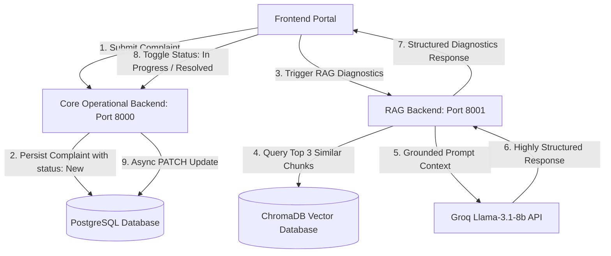

# Maintainer AI — Intelligent Maintenance Agent System

Maintainer AI is a premium, high-fidelity agentic AI platform designed to process natural language industrial equipment complaints, classify issues, prioritize tasks, and deliver structured, context-grounded troubleshooting procedures. 

The system leverages a modern **Three-Tier Service Architecture**:
1.  **Interactive Client Portal (React + Vite + Vanilla CSS)**: A luxury Vercel/Linear-inspired dark-mode-accented workspace with premium visual card systems, dynamic timeline flows, and safety banners.
2.  **Core Operational Backend (`Maint_backend` - FastAPI + PostgreSQL + Prisma ORM)**: Persists complaints, generates unique ticket numbers, and provides dynamic ticket status synchronization.
3.  **Context-Grounded RAG Pipeline (`RAG_backend` - FastAPI + ChromaDB + SentenceTransformers)**: Ingests heavy industrial maintenance manuals (`maintenance-engineering-handbook.pdf`) locally, performs semantic vector search, and uses Llama-3.1-8b (via Groq) to draft strict safety precautions and technical guidelines.

---

##  System Architecture Flow


---

##  Unified Quick Start & Setup

### Prerequisites
*   **Python**: Version `3.12+` installed.
*   **Node.js & npm**: Installed for frontend builds.
*   **PostgreSQL Database**: A running instance (Supabase, ElephantSQL, or Local PostgreSQL).
*   **Groq API Key**: A valid Groq Cloud API key (obtainable at [Groq Console](https://console.groq.com/)).

---

### Step 1: Database Setup & Configuration
1. Open or create the configuration `.env` inside `Maint_backend/.env`:
   ```env
   # Groq API Credentials
   GROQ_API_KEY=gsk_your_groq_api_key_goes_here

   # PostgreSQL Connection URL
   DATABASE_URL=postgresql://[user]:[password]@[host]:[port]/[database_name]
   ```
2. Navigate to `Maint_backend` and initialize virtual environment, Prisma models, and PostgreSQL migrations:
   ```bash
   cd Maint_backend
   python3 -m venv venv
   source venv/bin/activate
   pip install -r requirements.txt
   
   # Generate Prisma Client & Migrate Schema
   prisma generate --schema app/prisma_schema.prisma
   prisma db push --schema app/prisma_schema.prisma
   ```

---

### Step 2: RAG Backend & Manual Ingestion
1. Place your target industrial maintenance guide (`maintenance-engineering-handbook.pdf`) in the root directory.
2. Open or create the configuration `.env` inside `RAG_backend/.env`:
   ```env
   GROQ_API_KEY=gsk_your_groq_api_key_goes_here
   ```
3. Navigate to `RAG_backend`, activate virtual environment, and run manual ingestion to populate vector space:
   ```bash
   cd ../RAG_backend
   python3 -m venv venv
   source venv/bin/activate
   pip install -r requirements.txt
   
   # Run ingestion (Extracts text, splits chunks, generates SentenceTransformer embeddings into ChromaDB)
   python3 app/ingest.py
   ```

---

###  Step 3: Frontend Client Installation
1. Navigate to the `frontend` folder and install packages:
   ```bash
   cd ../frontend
   npm install
   ```

---

##  Running the Services Locally

To run the complete system, you must start all three services simultaneously.

### 1. Start Core Operational Backend (Port `8000`)
```bash
cd Maint_backend
source venv/bin/activate
uvicorn app.main:app --reload --port 8000
```
*API docs will be available at: `http://localhost:8000/docs`*

### 2. Start RAG Diagnostic Backend (Port `8001`)
```bash
cd RAG_backend
source venv/bin/activate
uvicorn app.main:app --reload --port 8001
```
*RAG docs will be available at: `http://localhost:8001/docs`*

### 3. Start Frontend Portal (Port `5173`)
```bash
cd frontend
npm run dev
```
*Portal will launch at: `http://localhost:5173`*

---

##  Premium Visual Elements (Vite + CSS Styling)

We have customized the user interface with high-fidelity, hand-crafted aesthetic components:
*   **Concentric Geometric "M" Logo**: A stunning pure CSS 16-pointed wireframe star formed by concentric rotated layers (`0deg`, `45deg`, `22.5deg`, `67.5deg`) with transparent coral boundaries (`#ff5e7e`). It performs a smooth `15deg` rotational concentric twist transition and scale animation on hover.
*   **Color Accents**: 
    *   **Forest Green Active Button**: The active "Dashboard" sidebar item renders with a gorgeous forest green background (`#306D29`) and white text.
    *   **Teal Submit Button**: The ticket "Submit to Agent" button has a high-contrast bright pastel mint-teal background (`#8BDFDD`) and dark charcoal text (`#000000` with `font-weight: 700`) for premium contrast and modern glassmorphic look.
*   **RAG Structured Timeline & Safety Banners**: Overhauls standard markdown response blocks. If the RAG response is structured, it separates content into:
    *   * Summary Card*: Soft-blue layout callout with a thick left-border accent.
    *   * Procedure Timeline*: Interactive numbered vertical timeline flow linking steps beautifully.
    *   * Safety Warning Alert Box*: Heavy emergency callout with soft-red background and deep-crimson left accent border.

---

##  Architecture Decisions & Production Specifications

### Assumptions Made
1.  **Groq Infrastructure Availability**: Assumed local developers have access to a Groq API Key to execute Llama-3.1-8b queries synchronously.
2.  **Stateless API Design**: Assumed ticket status patches and data operations occur over standard transactional REST HTTP calls. 
3.  **Local Vector DB Sufficiency**: For a single massive PDF manual (`maintenance-engineering-handbook.pdf`), a persistent local SQLite-backed Chroma vector store using open-source `SentenceTransformers` (`all-MiniLM-L6-v2`) is highly optimized, eliminating recurring third-party embedding API costs.

### Trade-offs Considered
1.  **FastAPI/Python Prisma ORM vs Node.js/TypeScript**: 
    *   *Trade-off*: Node.js has great Webpack/Vite synergy, but Python is the industry leader for heavy AI workloads (PDF text extraction, chunking, SentenceTransformers vectorization).
    *   *Decision*: Built backend in Python (FastAPI) while utilizing **Prisma ORM for Python** to maintain type-safe database schemas.
2.  **Zero-Dependency Regex Parser vs heavy JSON validation (Instructor/Langchain Output Parser)**:
    *   *Trade-off*: Forcing JSON outputs from LLMs blocks streaming, increases generation latency by up to `2.5x`, and inflates token cost.
    *   *Decision*: Crafted a highly precise structured markdown instruction set inside `prompt_template.py` coupled with a high-performance frontend regex parser inside `RAGChatbot.jsx`. This delivers instantaneous, streaming-friendly timeline and warning banners with zero UI delay.
3.  **Local SQLite ChromaDB vs pgvector/Pinecone**:
    *   *Trade-off*: Pinecone handles millions of vectors instantly, but requires api subscriptions and credentials.
    *   *Decision*: Used ChromaDB persistent client local directories, enabling seamless zero-config manual ingestion directly within the developer's local filesystem.

### Recommended Production Improvements
1.  **Consolidated Relational & Vector Storage**: 
    *   Migrate local SQLite ChromaDB and cloud PostgreSQL into a unified **Supabase PostgreSQL** instance with `pgvector` enabled. This guarantees ACID transactions, cross-table joins between tickets and vector embeddings, and unified schema migrations.
2.  **Serverless Background Task Processing**:
    *   For ingestion pipelines (chunking and vectorizing massive new PDFs), offload processing to an asynchronous worker queue like **Celery & Redis** or **Temporal** instead of executing them in FastAPI background threads.
3.  **Semantic Query Caching**:
    *   Implement an in-memory **Redis Semantic Cache** (such as GPTCache) to intercept incoming complaints. If an issue matches a previously vectorized query within `95%` similarity, retrieve the cached troubleshoot timeline immediately, cutting down LLM generation latency to `<10ms`.
4.  **Multi-Tenant Isolation & Authentication**:
    *   Introduce OAuth2 (e.g., Auth0 or Clerk) to isolate relational records and RAG manual queries on a per-organization/tenant level.
5.  **TypeScript & Component Isolation**:
    *   Migrate the Vite JS portal to TypeScript for compile-time safety and extract complex inline styles into global modular CSS variables for advanced system-wide theme toggling.
