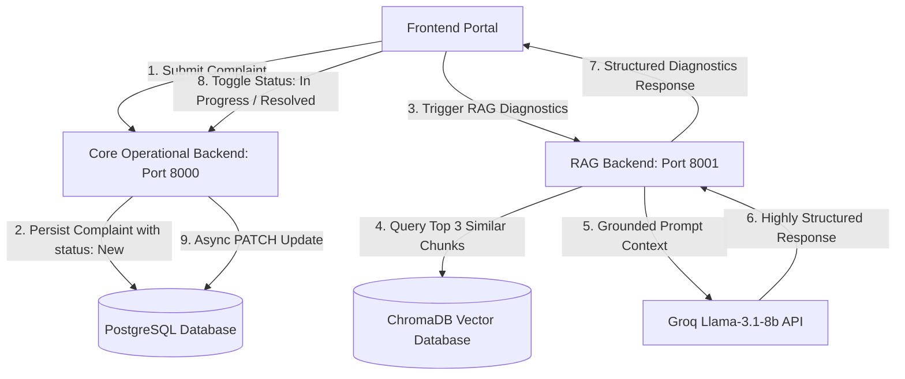

# Maintainer AI — Intelligent Maintenance Agent System

Maintainer AI is a premium, high-fidelity agentic AI platform designed to process natural language industrial equipment complaints, classify issues, prioritize tasks, and deliver structured, context-grounded troubleshooting procedures. 

The system leverages a modern **Three-Tier Service Architecture**:
1.  **Interactive Client Portal (React + Vite + Vanilla CSS)**: A luxury Vercel/Linear-inspired dark-mode-accented workspace with premium visual card systems, dynamic timeline flows, and safety banners.
2.  **Core Operational Backend (`Maint_backend` - FastAPI + PostgreSQL + Prisma ORM)**: Persists complaints, generates unique ticket numbers, and provides dynamic ticket status synchronization.
3.  **Context-Grounded RAG Pipeline (`RAG_backend` - FastAPI + ChromaDB + SentenceTransformers)**: Ingests heavy industrial maintenance manuals (`maintenance-engineering-handbook.pdf`) locally, performs semantic vector search, and uses Llama-3.1-8b (via Groq) to draft strict safety precautions and technical guidelines.

---

##  System Architecture Flow


---

##  Unified Quick Start & Setup

### Prerequisites
*   **Python**: Version `3.12+` installed.
*   **Node.js & npm**: Installed for frontend builds.
*   **PostgreSQL Database**: A running instance (Supabase, ElephantSQL, or Local PostgreSQL).
*   **Groq API Key**: A valid Groq Cloud API key (obtainable at [Groq Console](https://console.groq.com/)).

---

### Step 1: Database Setup & Configuration
1. Open or create the configuration `.env` inside `Maint_backend/.env`:
   ```env
   # Groq API Credentials
   GROQ_API_KEY=gsk_your_groq_api_key_goes_here

   # PostgreSQL Connection URL
   DATABASE_URL=postgresql://[user]:[password]@[host]:[port]/[database_name]
   ```
2. Navigate to `Maint_backend` and initialize virtual environment, Prisma models, and PostgreSQL migrations:
   ```bash
   cd Maint_backend
   python3 -m venv venv
   source venv/bin/activate
   pip install -r requirements.txt
   
   # Generate Prisma Client & Migrate Schema
   prisma generate --schema app/prisma_schema.prisma
   prisma db push --schema app/prisma_schema.prisma
   ```

---

### Step 2: RAG Backend & Manual Ingestion
1. Place your target industrial maintenance guide (`maintenance-engineering-handbook.pdf`) in the root directory.
2. Open or create the configuration `.env` inside `RAG_backend/.env`:
   ```env
   GROQ_API_KEY=gsk_your_groq_api_key_goes_here
   ```
3. Navigate to `RAG_backend`, activate virtual environment, and run manual ingestion to populate vector space:
   ```bash
   cd ../RAG_backend
   python3 -m venv venv
   source venv/bin/activate
   pip install -r requirements.txt
   
   # Run ingestion (Extracts text, splits chunks, generates SentenceTransformer embeddings into ChromaDB)
   python3 app/ingest.py
   ```

---

###  Step 3: Frontend Client Installation
1. Navigate to the `frontend` folder and install packages:
   ```bash
   cd ../frontend
   npm install
   ```


## 🏃 Running the Services Manually (Local Processes)

To run the complete system, you must start all three services simultaneously.

### 1. Start Core Operational Backend (Port `8000`)
```bash
cd Maint_backend
source venv/bin/activate
uvicorn app.main:app --reload --port 8000
```
*API docs will be available at: `http://localhost:8000/docs`*

### 2. Start RAG Diagnostic Backend (Port `8001`)
```bash
cd RAG_backend
source venv/bin/activate
uvicorn app.main:app --reload --port 8001
```
*RAG docs will be available at: `http://localhost:8001/docs`*

### 3. Start Frontend Portal (Port `5173`)
```bash
cd frontend
npm run dev
```
*Portal will launch at: `http://localhost:5173`*


## 📄 Architecture Decisions & Production Specifications (Backend & AI)

### Genuine Assumptions Made (Backend & AI)

1.  **Fault-Tolerant LLM Output Parsing (`llm_service.py`)**: 
    We assume that despite utilizing Groq's JSON mode (`response_format={"type": "json_object"}`), LLM API timeouts, rate-limiting, or malformed JSON responses will occur. To prevent backend processing crashes and blockages in core ticket logging, the `LLMService` implements a local keyword-based heuristic fallback system (`_get_fallback_payload`). This assumes that scanning the input complaint text for keywords (e.g., `motor`, `wire`, `voltage` for `Electrical` classification; `gear`, `pump`, `leak` for `Mechanical`) and searching for emergency patterns (e.g., `smoke`, `fire`, `spark` for `High` priority) is a reliable method to successfully classify and log a ticket when LLM communication fails.
2.  **State-Transient Connection Pooling Safeguards (`complaint_routes.py` & `maintenance_agent.py`)**:
    We assume that PostgreSQL connections made via Python's Prisma ORM client are transient and prone to dropping or idling. Instead of assuming a persistent, always-open pool connection, every database retrieval and update in our backend route handlers explicitly triggers `if not db.is_connected(): await db.connect()`. This ensures that even after long periods of inactivity, incoming complaints and status changes execute cleanly without connection resets.
3.  **Sequential Ticket Prefix Soundness (`ticket_service.py`)**:
    We assume that looking up the highest sequential ID (`TKT-YYYY-XXXX`) using `startswith` and a descending sort (`order={"ticket_id": "desc"}`) is a mathematically sound method for identifying the last sequence number for incrementing. This relies entirely on the assumption that all ticket string indexes in the database remain strictly formatted and padded. If this query fails or times out, the service falls back to generating a pseudo-randomized sequence suffix (`random.randint(1, 9999)`) to prevent blocking the ticket submission path.
4.  **Noisy Document Chunk Extraction (`chunking_service.py`)**:
    We assume that raw text extracted page-by-page from PDFs using PyMuPDF (`fitz`) contains non-printable noise characters and null bytes (`\x00`). The service explicitly strips these characters (`clean_text = text.replace("\x00", "").strip()`) and enforces a strict quality-level constraint where chunks shorter than 10 characters (`if len(chunk_text.strip()) < 10: continue`) are filtered out entirely to avoid indexing meaningless chunks (like isolated page numbers or empty footer lines) in ChromaDB.
5.  **Strict Prompt-Based Grounding Constraints (`prompt_template.py`)**:
    We assume that the best protection against LLM hallucinations in industrial operations is a zero-speculation prompt. `prompt_template.py` forces a strict grounding contract: if the similarity search results contain insufficient details to answer the question, the LLM must output *only* the following text verbatim: `"I could not find relevant information in the maintenance knowledge base."`. This ensures that safety-critical troubleshooting actions are never hallucinated.

### Technical Trade-offs Considered (Backend & AI)

1.  **FastAPI (Python) + Prisma ORM vs. Node.js/TypeScript or SQLAlchemy**:
    *   *Trade-off*: While Node.js has great concurrency synergy and TypeScript is standard for type safety, and SQLAlchemy is the traditional Python ORM, they introduce either boundary serialization overhead or complex, verbose boilerplate code.
    *   *Decision*: We selected **FastAPI** to benefit from high-performance asynchronous event loops and direct integration with heavy AI workloads (PyMuPDF text extraction, local SentenceTransformers vectorization). We chose **Prisma ORM for Python** to maintain clean, type-safe database schemas and migrations without the heavy setup of SQLAlchemy.
2.  **Robust In-Memory Database Fallbacks vs. Fail-Fast Validation**:
    *   *Trade-off*: In standard web architectures, database lookup or LLM integration failures should trigger an immediate fail-fast error (`503 Service Unavailable` or `500 Internal Server Error`) to keep states fully consistent.
    *   *Decision*: In an industrial maintenance setting, service availability is critical—a technician must be able to log a machine failure immediately. We traded transaction strictness for high availability. In `llm_service.py` and `ticket_service.py`, if a database sequence lookup fails or the Groq API times out, the backend silently handles the error and dynamically builds a fallback payload with estimated values, ensuring logging operations remain active.
3.  **Local SQLite ChromaDB + SentenceTransformers vs. Cloud pgvector/Pinecone**:
    *   *Trade-off*: A cloud vector database like Pinecone offers scalable indexing but introduces external API dependency, network latency, and operational subscription fees.
    *   *Decision*: For indexing a single maintenance handbook (`maintenance-engineering-handbook.pdf`), a local persistent SQLite-backed Chroma vector store using open-source SentenceTransformers (`all-MiniLM-L6-v2`) is highly optimized. It eliminates third-party subscription fees, enables complete offline data processing, and operates inside the local server's filesystem, making it a zero-config solution.

### Recommended Production Improvements (Backend & AI)

1.  **Offload Heavy CPU Processing to Dedicated Distributed Workers**:
    *   *Current Implementation*: The `/ingest` route inside `rag_routes.py` offloads PyMuPDF document loading, recursive chunking, and SentenceTransformer embedding generation to FastAPI's built-in `BackgroundTasks`.
    *   *Production Path*: Because generating embeddings is highly CPU-bound and blocks Python's single-threaded event loop, a large PDF manual ingestion can freeze the API for minutes. In production, the ingestion pipeline should be offloaded to a dedicated distributed task queue like **Celery & Redis** or **Temporal**, running on separate worker nodes configured with GPU acceleration for SentenceTransformers.
2.  **Consolidated Relational & Vector Storage (pgvector + Supabase)**:
    *   *Current Implementation*: We split data across a local SQLite ChromaDB instance and a PostgreSQL relational database.
    *   *Production Path*: To enable relational joins between ticket IDs and vector search chunks (e.g., querying "give me all tickets that match this section of the safety guide"), we should consolidate databases into a single **PostgreSQL instance with the pgvector extension** enabled. This allows ACID-compliant transactional migrations and unified schemas.
3.  **Deterministic Token-Level JSON Generation (Pydantic / Instructor)**:
    *   *Current Implementation*: `llm_service.py` passes a JSON prompt schema and parses the response string with Python's native `json.loads()`.
    *   *Production Path*: To prevent runtime JSON decode errors and guarantee that keys like `issue_type`, `priority`, and `summary` conform strictly to expected database schemas, we should integrate a structured schema validation tool like **Pydantic** coupled with **Instructor** or **Outlines** to force token-level constraint generation.
4.  **Semantic Query Caching (Redis Semantic Cache)**:
    *   *Current Implementation*: Every technical question asked in the chatbot triggers an active embedding generation and a Groq API call.
    *   *Production Path*: We should introduce a **Redis Semantic Cache** (such as GPTCache) to intercept incoming complaints and questions. If a technician asks a question that matches a previously answered query within a 95% similarity threshold, the system immediately serving the cached action plan timeline, cutting LLM latency to `<10ms` and saving Groq tokens.
5.  **Dynamic PDF Page & Metadata Tracking**:
    *   *Current Implementation*: The chunking service `chunking_service.py` tracks only the source filename in metadata.
    *   *Production Path*: We should modify the PyMuPDF parsing loop to capture the physical page number (`page.number`) of the PDF as each chunk is split. This will allow the React frontend to display clickable, high-fidelity citation links (e.g., *"Source: Maintenance Handbook, Page 142"*), allowing technicians to cross-reference procedures in the original manual.


